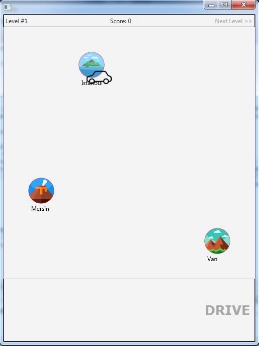
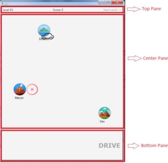

**CSE1242 Computer Programming II (Spring 2023) Term Project** 

(Due: 22.05.2023 – 23:59) 

In the term project, you will implement the following game by using JavaFX framework. This game aims to transfer all passengers from a starting city to the desired city with the highest score. Initial state of the game can be seen in the figure below (Figure 1.a): 

` `

(a)  (b) Figure 1: Game Screen 

The game board consists of 10x10 city cells. Each cell identified by a cell ID starts with 1 and increases row based ascending order as shown in Figure 1.b. In the game, there will be four different objects which are a vehicle, cities, passengers and fixed cells. Your aim is to transport passengers from one city to another with the highest score. For transferring the passengers, user will select only vehicle destination city with mouse and click “DRIVE” button/text to move vehicle to the destination city.  

For the project, you will implement this game with the following properties: 

- There will be several levels; the user will not be able to play a next level without completing a previous one. 
- Each level will be created based on an input file that will be provided separately. 
- Each of these input files should be located in the “levels” folder in your current directory. 
- There is no limit for the total number of levels (i.e., there can be 3-levels, 5-levels, 10-levels, etc.). 
- Each city should have an image and city name on the map.  
- Images for cities could be randomly assigned but there should be at least six different city images. 
- Your program must draw a drive path between the city where the vehicle is located and the city selected by the user. (as shown in Figure 2.b). 
- The drive path should only be created using empty/unused cells. Fixed cells cannot be used for the drive path and the vehicle cannot pass over it. 
- A vehicle can only move in horizontal and vertical (right, left, up and down) directions. Vehicle cannot move diagonally.  
- When the user clicks “DRIVE”, the vehicle follows the path and moves towards to the destination city using animations. 
- Use different vehicle images based on the passenger capacity (Less than 6 passenger capacity use car image, less than 14 use minibus image and greater than 14 use bus image) 
- While you are constructing the game board, you may use images for each city, vehicle, etc. 

**GAME LAYOUT** 

The game layout should consist of three parts as shown in Figure 2.  

*Top Pane:* It must include current level number, current level score and next level button. 

*Center Pane*: The game board size should be 10x10 city cells. It should be noted that gridlines are disappeared.  

*Bottom Pane:* It contains two parts; first part is the destination city information which are the name of the destination city, the distance between the starting and the destination city in terms of cells, vehicle capacity and the number of all passengers. The second part is “DRIVE” button. 

 

**(a)  (b) Figure 2: Game Layout** 

**GAME BOARD CREATION** 

Level appearances will be prepared using input files. The appearance of first level (Level 1) is illustrated in Figure 3. There are totally 100 city cell (10x10) on the game board, each with different characteristics. Game board must be created according to the data in input file. 

|||
**Level 1 Input File:** 

City,Istanbul,14,1 City,Van,89,2 City,Mersin,62,3 Fixed,63 Passenger,9,1,2 Passenger,10,3,1 Passenger,13,1,3 Vehicle,1,5
|
| :- | :- | - |
|**Figure 3: Game Screen for Level 1** |||
**Level Input File** 

Input file contains the <object name> and related attributes, each separated by commas.  

City type object <City>,<city\_name>,<cell\_id>,<city\_id> 

Passenger type object 

<Passenger>,<number\_of\_passengers>,< starting\_city\_id >,<destination\_city\_id> 

Vehicle type object <Vehicle>,<current\_city\_id>,<passenger\_capacity> 

Fixed Cell type object <Fixed>,<cell\_id> 

Ex:  

City,Istanbul,14,1 

- Object type: City 
- City Name: Istanbul 
- Location cell id on game board: 14 
- City id: 1 

Passenger,10,3,1 

- Object type: Passenger 
- Number of passengers: 10 
- Starting city id: 3 (Name of city id 3 is Mersin) 
- Destination city id: 1 (Name of city id 1 is Istanbul) 

So in Mersin there are 10 passengers waiting for move to the Istanbul  

Vehicle,1,10 

- Object type: Vehicle 
- Current city id: 1 (Name of city id 1 is Istanbul) 
- Passenger capacity: 10 (vehicle seat capacity) 

Fixed,63 

- Cell id 63 cell is defined fixed cell.  

**SCORE CALCULATION** 

At the end of every move between cities, there is a cost and an income. Cost value is the distance between two cities. Income value is calculated using the transferred number of passengers and distance value.  

Cost = distance 

Income = (number of passengers transferred) \* (distance \* 0.2) Move score = Income – Cost 

For example, transferring 10 passengers from Istanbul to Mersin in Level1 input file is calculated as follows: 

- Istanbul cell id is 14 so Istanbul position on game board is in the 2nd row and 4th column.  
- Mersin cell id is 62 so Mersin position on game board is 7th row and 2nd column.  
- The distance between two points, first point is (2, 4) and second is (7, 2), is 5.39 based on Euclidean distance and you can calculate the distance as 6 by taking the ceiling of that value.  
- The Income value is 12 (10 \* 6 \* 0.2) based on the given formula above.  
- So, move score from Istanbul to Mersin for this case is 6 (12 – 6).  

**LEVELS** 

You should use the input files those are generated for each level to construct the game. Level appearances may be similar as follows: 

|
Level 1 

|
Level 2 

|
| - | - |
|
Level 3 

|
Level 4 

|
|Level 5 |

**Bonus Point** 

You can get bonus points by adding extra features to the project.  Some features you can add to the project;  

- Adding a second vehicle with the same passenger capacity compared to the first one located on a random city. Adding a second vehicle with a 20% increase passenger capacity compared to the first one located on a random city.  
- Adding a new scene for the user interface. Adding a set of buttons to the UI (etc. New game, Continue game, High scores) 
- Adding Save Game and Load Game features to the project.   

**SUBMISSION INSTRUCTIONS** 

1) The due date for the project is 22/05/2023. You are supposed to work in groups of 3 people.  
1) Please zip and submit your files using filename Student1Number\_Student2Number\_Student3Number\_Project.zip (ex: 150120042\_150118123\_150717015\_Project.zip) to Canvas system (under Assignments tab). Your zip file should contain the following files: 
1) The commented source code of your project.  
2) A 5-10 pages long project report that contains UML diagram of your project, implementation details, and screenshots. 

**DEMO SESSIONS** 

You will have demo sessions in the week of 23/05-04/06/2023. The exact time and date will be announced later.  

You should demonstrate what you have done in 15-20 minutes. You should also answer some questions about your implementation. Each group member will be assessed separately. 

**DETAILS ABOUT PROJECT REPORT** 

1) Your project reports are to be typed with normal sizes (Ex: Times New Roman 12pt.). 
1) Your report must have a cover page with the following information: 
   1) Title 
   1) Project Name 
   1) Authors (IDs, Names, and Surnames) 
   1) CSE1242 Computer Programming II, Spring 2023 
   1) Date Submitted: May 22, 2023 
1) Firstly, you should provide a section named as “Problem Definition” and briefly describe the problem or the game in your project in 1-2 paragraphs with your own words. 
1) Then, you should add a section named as “Implementation Details” and provide the UML diagrams of your project. In this section, you should also describe how you design and implement the project in more detail. 

a) Additionally, you may provide information about 

1) which parts are complete/incomplete in your project? 
1) what are the difficulties you have encountered during the implementation? 
1) what are the additional functionalities of your project added by your team? 
5) Then, you should add a section named as “Test Cases” and this section should contain the results of your testing phase. You should provide the screenshots of your project execution for the given test cases and add explanations about them. Filling this part only with screenshots is not a feasible solution. 
5) These are the minimum requirements for your project report. You can add more. 
5) The most important part about writing a project report is using your own words without copying-pasting from the Internet or the project document. Please show your own work. 

**NOTES** 

1) Write a comment at the beginning of each program to explain the purpose of the program. 
1) Write your names and student IDs as a comment. 
1) Include detailed comments to explain your actions. Since this is the term project, lack of comments will have an effect on your final grade. 
1) Select meaningful names for your variables and class names. 
1) In case of any form of copying and cheating on solutions, you will get FF grade from the course! You should submit your own work. In case of any forms of cheating or copying, both giver and receiver are equally culpable and suffer equal penalties. All types of plagiarism will result in FF grade from the course. 
1) No late submission will be accepted. 
